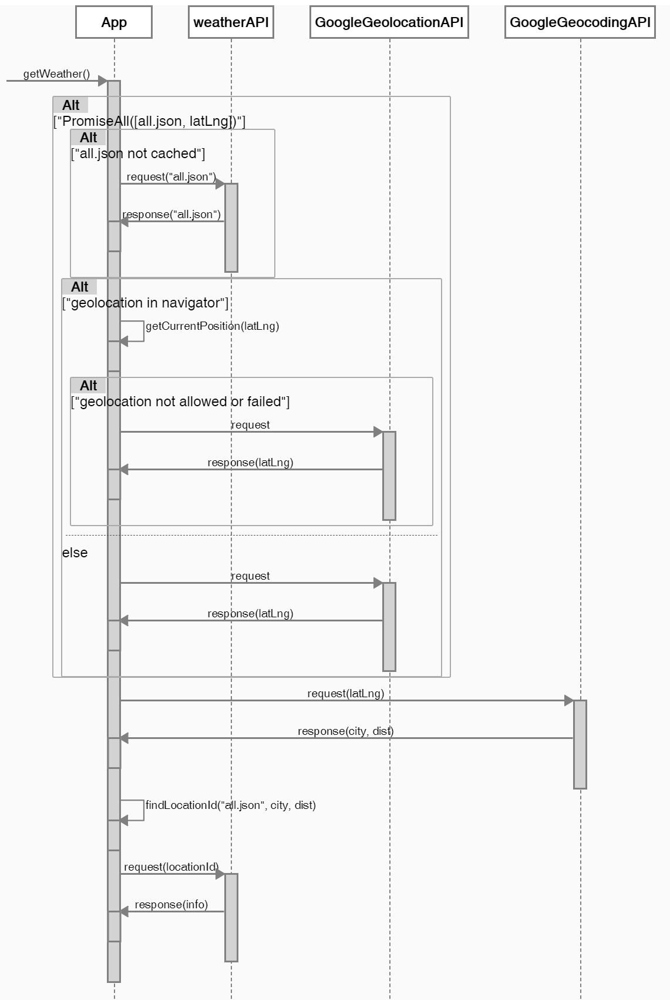

# 天氣時鐘 Progressive Web App

Demo: https://ronnie-weather-clock.firebaseapp.com

一個簡易的天氣時鐘網頁，讓舊手機也能當天氣桌鐘使用，由於是PWA，Android 手機預設的 Chrome 瀏覽器會出現「加到主畫面」的選項，方便變成單獨App使用。天氣為每小時自動更新。


# 使用API

* [OpenWeatherMap](https://openweathermap.org)
* [Google Geolocation API](https://developers.google.com/maps/documentation/geolocation/intro)

# 開發

使用 [Create React App](https://github.com/facebookincubator/create-react-app)
建置。尚未 `yarn eject` ，更多開發說明可參考[原README](README-react.md)。

## 簡易指令

本機端 Live 開發
```
yarn start
```
編譯檔案
```
yarn build
```


## UML

